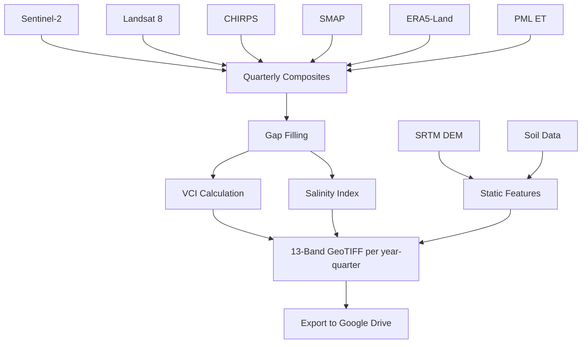
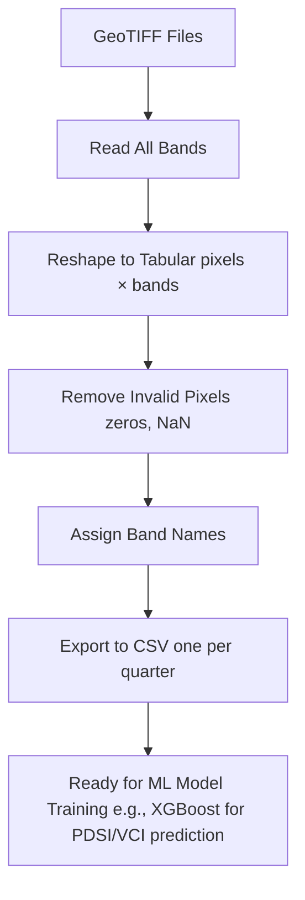

# CODE EXPLANATION 

**Project:** VCI (Vegetation Condition Index) Prediction - Nakhon Sawan, Thailand  
**Data Period:** 2018-2021 (Quarterly)  

---

## FILE 1: GEE_Scripts.js
**PURPOSE:** Google Earth Engine script for collecting and exporting multi-source satellite data as GeoTIFF raster files.

### OVERVIEW
This script runs on Google Earth Engine (GEE) to automatically collect satellite imagery and climate data for Nakhon Sawan province, Thailand. It processes data quarterly (Q1-Q4) for years 2018-2021, producing 16 multi-band raster files (4 years × 4 quarters) that serve as the raw input for the machine learning pipeline.

### SECTION-BY-SECTION EXPLANATION

#### [Section 0: Study Area Definition] (Lines 12-15)
- Loads the FAO GAUL Level 2 administrative boundary dataset.
- Filters to select only "Nakhon Sawan" province using the ADM1_NAME field.
- Centers the GEE map interface on the study area at zoom level 8.
- This boundary is used throughout the script to clip all satellite data to the province extent.

#### [Section 1: Configuration] (Lines 20-21)
- Defines the temporal scope: years 2018, 2019, 2020, 2021.
- Defines quarterly divisions: Q1 (Jan-Mar), Q2 (Apr-Jun), Q3 (Jul-Sep), Q4 (Oct-Dec).
- These arrays drive the nested loop that generates all year-quarter combinations.

#### [Section 2: Preprocessing Functions] (Lines 28-41)
Two helper functions are defined:

1. **`maskS2(image)` - Sentinel-2 Cloud Masking**
   - Uses the Scene Classification Layer (SCL) band from Sentinel-2 Level-2A.
   - Removes cloud shadow (SCL = 3) and cloud/cirrus pixels (SCL >= 8).
   - Divides reflectance values by 10000 to convert from integer DN values to physical reflectance (0-1 range).

2. **`prepL8(img)` - Landsat 8 Thermal Processing**
   - Selects the thermal band `ST_B10` (Surface Temperature).
   - Applies the scale factor (0.00341802) and offset (149.0) to convert from raw DN to Kelvin.
   - Subtracts 273.15 to convert from Kelvin to Celsius.
   - Renames the output band to `LST_Thermal`.

#### [Section 3: Static Features] (Lines 48-57)
Two time-invariant (static) datasets are loaded:

1. **DEM (Digital Elevation Model)**
   - Source: USGS SRTM 30m resolution.
   - Provides terrain elevation data which influences temperature, rainfall patterns, and vegetation distribution.

2. **Soil Texture**
   - Source: OpenLandMap USDA soil texture classification.
   - Uses the top layer (b0) which classifies soil into types (e.g., sandy, clay, loam).
   - Soil type affects water retention and drought susceptibility.

#### [Section 4: Main Processing Loop] (Lines 62-234)
Iterates through every year × quarter combination (16 total). For each combination, it computes:

##### 4.1 Sentinel-2 Optical Data (Lines 74-90)
- Creates a quarterly median composite from Sentinel-2 SR Harmonized imagery using bands B2 (Blue), B3 (Green), B4 (Red), B8 (NIR).
- Also creates a yearly median composite of the same bands.
- Uses the yearly composite to fill gaps (missing pixels) in the quarterly composite. This "gap-filling" technique addresses the seamline/coverage issue where quarterly data may have holes due to persistent cloud cover.

##### 4.2 Landsat 8 Thermal Data (Lines 96-109)
- Creates a quarterly median composite of Land Surface Temperature.
- Also creates a yearly median composite for gap-filling.
- Same gap-filling approach as Sentinel-2 to ensure complete spatial coverage.

##### 4.3 VCI Calculation (Lines 116-145)
Vegetation Condition Index (VCI) is the **TARGET VARIABLE**.
Calculation steps:
1. Compute NDVI from current quarter: `(NIR - Red) / (NIR + Red)`
2. Build a historical NDVI baseline from 2017 to the current year, filtered to the same seasonal months (same quarter).
3. Calculate robust min/max using the 5th and 95th percentiles (instead of absolute min/max to reduce outlier effects).
4. Compute VCI = `((NDVI_current - NDVI_min) / (NDVI_max - NDVI_min)) × 100`
5. Clamp values to 0-100 range.
6. A safety check prevents division by zero when NDVI range is 0 by substituting a small constant (0.001).

**VCI Interpretation:**
- `0-10`: Extreme drought
- `10-20`: Severe drought
- `20-30`: Moderate drought
- `30-40`: Mild drought
- `40-100`: No drought

##### 4.4 Climate Features (Lines 152-196)
Four climate/environmental variables are computed:

1. **Rain_Sum** (CHIRPS Daily Precipitation)
   - Sums all daily rainfall values within the quarter.
   - Unit: mm (total quarterly rainfall).

2. **Soil_Moisture** (NASA SMAP Level 4)
   - Takes the median surface soil moisture for the quarter.
   - Resampled using bilinear interpolation to match 30m resolution.
   - Unit: m³/m³

3. **Air_Temp** (ERA5-Land Reanalysis)
   - Computes mean 2-meter air temperature for the quarter.
   - Converts from Kelvin to Celsius.
   - Unit: °C

4. **ET** (PML V2 Evapotranspiration)
   - Computes mean ET and multiplies by 90 (approximate days in quarter) to get quarterly total.
   - Includes a fallback mechanism: if data is unavailable for the specific quarter, it uses a climatological average from the same seasonal months across all available years.
   - Resampled using bilinear interpolation.
   - Unit: mm/quarter

##### 4.5 Salinity Index (Lines 201-204)
- Computed as: `sqrt(Blue × Red)`
- This spectral index is sensitive to salt-affected soils.
- Higher values indicate higher potential soil salinity.

##### 4.6 Feature Combination (Lines 209-220)
All features are stacked into a single multi-band image:
- **Band 1:** Blue (Sentinel-2 B2 reflectance)
- **Band 2:** Green (Sentinel-2 B3 reflectance)
- **Band 3:** Red (Sentinel-2 B4 reflectance)
- **Band 4:** NIR (Sentinel-2 B8 reflectance)
- **Band 5:** LST_Thermal (Landsat 8 surface temperature, °C)
- **Band 6:** Rain_Sum (CHIRPS total rainfall, mm)
- **Band 7:** Soil_Moisture (SMAP surface moisture, m³/m³)
- **Band 8:** Air_Temp (ERA5-Land mean temperature, °C)
- **Band 9:** ET (PML evapotranspiration, mm)
- **Band 10:** DEM (SRTM elevation, meters)
- **Band 11:** Soil_Texture (USDA classification code)
- **Band 12:** Salinity_Index (spectral index, unitless)
- **Band 13:** Target_VCI (target variable, 0-100)

The combined image is clipped to Nakhon Sawan and cast to Float32.

#### [Section 5: Export] (Lines 225-234)
- Exports each combined image to Google Drive as a GeoTIFF file.
- Folder: `VCI_Predict_Data`
- File naming: `VCI_YYYY_QN` (e.g., `VCI_2018_Q1`, `VCI_2021_Q4`)
- Resolution: 30 meters
- CRS: `EPSG:4326` (WGS84 Geographic)
- Max pixels: 10 trillion (to accommodate large rasters)

### OUTPUT
16 GeoTIFF files (`VCI_2018_Q1.tif` through `VCI_2021_Q4.tif`), each containing 13 bands of co-registered geospatial data at 30m resolution covering Nakhon Sawan province.

---

## FILE 2: Extract_Data_Pipeline.ipynb
**PURPOSE:** Python notebook for extracting pixel-level training data from the GeoTIFF raster files and converting them to CSV format.

### OVERVIEW
This Jupyter Notebook reads the multi-band GeoTIFF files produced by `GEE_Scripts.js` and converts them into tabular CSV format suitable for machine learning model training. Each row in the output CSV represents one pixel, and each column represents one spectral/climate/terrain band.

### SECTION-BY-SECTION EXPLANATION

#### [Part 1: Library Imports] (Cell 1, Lines 18-25 in notebook JSON)
- `pandas`: For DataFrame creation and CSV export.
- `numpy`: For numerical array operations (reshaping, masking).
- `rasterio`: For reading GeoTIFF raster files (band-by-band).
- `os`, `glob`: For file path handling and pattern matching.
- `warnings`: Suppressed to keep output clean during bulk processing.

#### [Part 1: Core Function - `process_raster_only()`] (Cell 2, Lines 34-66 in notebook JSON)
This is the main extraction function. Step-by-step:

**Input Parameters:**
- `raster_path`: Path to a `.tif` file
- `output_csv`: Path for the output CSV file
- `col_names`: Optional list of band names

**Processing Steps:**
1. Opens the GeoTIFF file using `rasterio`.
2. Reads ALL bands at once → returns a 3D array (bands, rows, cols).
3. Reshapes to 2D: `(num_pixels, num_bands)` where `num_pixels = rows × cols`. This converts the spatial grid into a tabular format where each row is one pixel and each column is one band value.
4. Applies a validity mask that removes:
   - Pixels where ALL band values are 0 (typically NoData or outside the study area boundary).
   - Pixels where ANY band value is `NaN` (missing data).
5. Creates a `pandas` DataFrame with descriptive column names.
6. Performs a final `dropna()` to catch any remaining null values.
7. Saves to CSV with UTF-8-BOM encoding (`utf-8-sig`) for compatibility with Thai-language Excel environments.

#### [Part 1: Batch Processing Loop] (Cell 3, Lines 74-96 in notebook JSON)

**Band Names Definition:**
Maps the 13 GeoTIFF bands to meaningful names:
- Band 1  → `Blue`           (Sentinel-2 B2)
- Band 2  → `Green`          (Sentinel-2 B3)
- Band 3  → `Red`            (Sentinel-2 B4)
- Band 4  → `NIR`            (Sentinel-2 B8)
- Band 5  → `Thermal`        (Landsat 8 LST)
- Band 6  → `Rain`           (CHIRPS rainfall sum)
- Band 7  → `Soil Moisture`  (SMAP surface moisture)
- Band 8  → `Air Temp`       (ERA5-Land temperature)
- Band 9  → `ET`             (PML evapotranspiration)
- Band 10 → `DEM`            (SRTM elevation)
- Band 11 → `Soil Texture`   (OpenLandMap classification)
- Band 12 → `Salinity_Index` (Spectral salinity index)
- Band 13 → `VCI`            (Target variable)

**File Discovery:**
- Uses `glob` to find all `.tif` files in the `TRAIN_DATA/` folder.
- Sorts files alphabetically for consistent processing order.

**Naming Convention:**
- Parses the filename (e.g., `VCI_2018_Q1.tif`) to extract the period string `2018_Q1`.
- Generates output filename: `train_data_2018_Q1.csv`

**Loop:**
- Iterates over all discovered TIFF files and calls `process_raster_only()` for each one.

#### [Part 2: Data Inspection] (Cell 4, Lines 113-129 in notebook JSON)
- Loads the first generated CSV file as a quick validation step.
- Reads only the first 1000 rows for efficiency.
- Displays:
  - `df.info()` → column names, data types, non-null counts, memory usage.
  - `df.head()` → first 5 rows of data to visually verify values.
- If no CSV files are found, prints an error message directing the user to run Part 1 first.

### OUTPUT
16 CSV files (`train_data_2018_Q1.csv` through `train_data_2021_Q4.csv`).
Each CSV contains:
- **Rows:** One per valid pixel (typically hundreds of thousands per file)
- **Columns:** 13 features (`Blue`, `Green`, `Red`, `NIR`, `Thermal`, `Rain`, `Soil Moisture`, `Air Temp`, `ET`, `DEM`, `Soil Texture`, `Salinity_Index`, `VCI`)
- **Encoding:** UTF-8 with BOM

---

## DATA PIPELINE SUMMARY

The overall workflow is a two-stage pipeline:

### Stage 1: Cloud-based data collection (`GEE_Scripts.js`)

### Stage 2: Local data extraction (`Extract_Data_Pipeline.ipynb`)

---
*Generated on: 2026-05-06*
