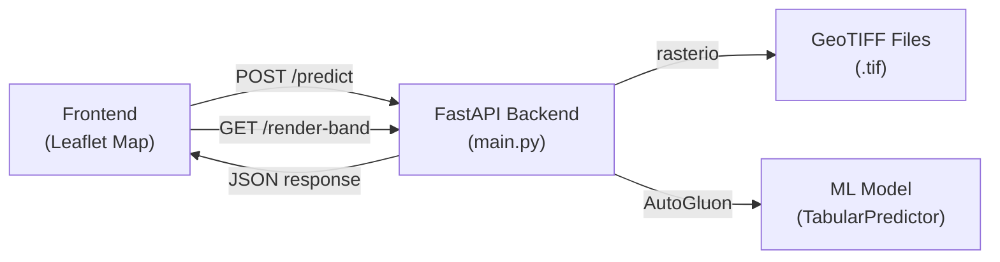
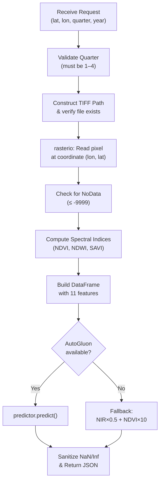
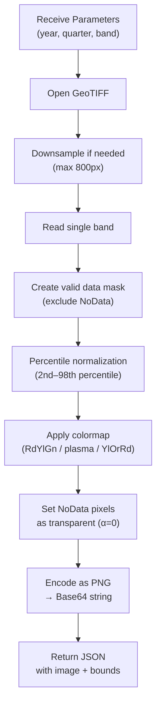
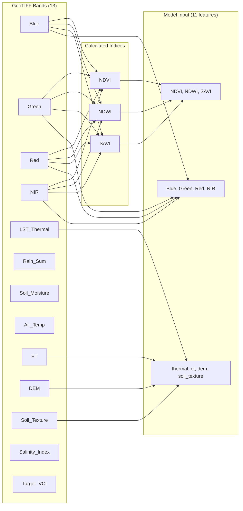

# 📖 Code Explanation — `main.py` (VCI Predictor Backend)

> **File**: [main.py](file:///e:/University/Year%203/GIS/DATA_PREPARE/WEBAPP/project/backend/main.py)
> **Role**: FastAPI backend for **predicting VCI (Vegetation Condition Index)** from satellite GeoTIFF data using an AutoGluon model, and rendering raster band overlays for the frontend map.

---

## 1. Architecture Overview



The system follows a **Client-Server** architecture: the frontend sends a request to the backend → the backend reads pixel values from a GeoTIFF → computes derived features → predicts VCI → returns a JSON response.

---

## 2. Imports & Dependencies

```python
from fastapi import FastAPI, HTTPException          # Web framework
from fastapi.middleware.cors import CORSMiddleware   # Cross-Origin support
from pydantic import BaseModel                       # Request validation
import rasterio                                      # Read/write GeoTIFF
from rasterio.enums import Resampling                # Raster resampling methods
import pandas as pd                                  # DataFrame for model input
import os, base64, numpy as np                       # Utilities
from io import BytesIO                               # In-memory buffer for image encoding
from PIL import Image                                # Convert array → PNG
import matplotlib.pyplot as plt                      # Colormaps for rendering
```

| Library | Purpose |
|---------|---------|
| **FastAPI** | Build REST API endpoints with automatic validation |
| **rasterio** | Read pixel-level data from multi-band GeoTIFF files |
| **AutoGluon** | Pre-trained ML model for VCI prediction |
| **Pillow + matplotlib** | Generate colorized raster overlay images (PNG) |

---

## 3. Application Setup ([L14–L22](file:///e:/University/Year%203/GIS/DATA_PREPARE/WEBAPP/project/backend/main.py#L14-L22))

```python
app = FastAPI(title="VCI Predictor API")

app.add_middleware(
    CORSMiddleware,
    allow_origins=["*"],       # Allow all origins (development mode)
    allow_credentials=True,
    allow_methods=["*"],
    allow_headers=["*"],
)
```

- Creates the FastAPI application instance.
- Enables **CORS (Cross-Origin Resource Sharing)** so the frontend (running on a different port) can call the API without being blocked by the browser's same-origin policy.

---

## 4. AutoGluon Model Loading ([L24–L34](file:///e:/University/Year%203/GIS/DATA_PREPARE/WEBAPP/project/backend/main.py#L24-L34))

```python
MODEL_PATH = "D:/work/GIS/project/autogluon_vci_model/autogluon_vci_model"
try:
    from autogluon.tabular import TabularPredictor
    predictor = TabularPredictor.load(MODEL_PATH)
    HAS_AUTOGLUON = True
except Exception as e:
    predictor = None
    HAS_AUTOGLUON = False
```

> [!IMPORTANT]
> The model is loaded **once at server startup** to avoid the overhead of reloading it on every request. If AutoGluon is not installed or the model path is invalid, the server gracefully falls back to a simple heuristic formula instead of crashing.

---

## 5. Data Schema & Band Definition ([L36–L49](file:///e:/University/Year%203/GIS/DATA_PREPARE/WEBAPP/project/backend/main.py#L36-L49))

### 5.1 Request Schema
```python
class PredictionRequest(BaseModel):
    lat: float       # Latitude
    lon: float       # Longitude
    quarter: int     # Quarter of the year (1–4)
    year: int = 2022 # Year (default: 2022)
```
Pydantic automatically validates incoming JSON — if any field is missing or has the wrong type, it returns a `422 Unprocessable Entity` error.

### 5.2 Band Mapping
```python
BANDS = [
    "Blue", "Green", "Red", "NIR", "LST_Thermal", "Rain_Sum",
    "Soil_Moisture", "Air_Temp", "ET", "DEM", "Soil_Texture",

    "Salinity_Index", "Target_VCI"
]
```

Each GeoTIFF file contains **13 bands**. The order in this list must **exactly match** the band order in the TIFF files.

---

## 6. Endpoint: `POST /predict` ([L51–L154](file:///e:/University/Year%203/GIS/DATA_PREPARE/WEBAPP/project/backend/main.py#L51-L154))

This is the **core endpoint** of the system — it receives coordinates and a time period, then returns a VCI prediction.

### 6.1 Flow Diagram



### 6.2 Step-by-Step Breakdown

#### ① Validation & File Lookup
```python
tiff_path = f"D:/work/GIS/project/Geotiff_Data/{req.year}/VCI_{req.year}_Q{req.quarter}.tif"
```
The TIFF path is dynamically constructed based on the requested **year** and **quarter**. If the file does not exist, the endpoint returns a `404` error.

#### ② Read Pixel Values from GeoTIFF
```python
row, col = src.index(req.lon, req.lat)             # Convert (lon, lat) → (row, col)
window = rasterio.windows.Window(col, row, 1, 1)   # Define a 1×1 pixel window
data = src.read(window=window)                      # Read all bands at that location
band_values = data[:, 0, 0].tolist()                # Flatten → Python list
```

> [!NOTE]
> `src.index(lon, lat)` takes **longitude first, latitude second** because rasterio uses the (x, y) coordinate convention where x = longitude and y = latitude.

#### ③ NoData Filtering
```python
for band_name, val in raw_features.items():
    if float(val) <= -9999:
        raise HTTPException(status_code=400,
            detail=f"NoData (-9999) found in band '{band_name}'")
```
If any band at the requested pixel contains a value ≤ −9999 (the NoData sentinel), the request is rejected. This prevents the model from making predictions based on missing or invalid data.

#### ④ Spectral Index Calculation (Feature Engineering)
```python
ndvi = (nir - red) / (nir + red + 1e-8)         # Normalized Difference Vegetation Index
ndwi = (green - nir) / (green + nir + 1e-8)     # Normalized Difference Water Index
savi = ((nir - red) / (nir + red + 0.5)) * 1.5  # Soil-Adjusted Vegetation Index
```

| Index | Formula | Interpretation |
|-------|---------|----------------|
| **NDVI** | (NIR − Red) / (NIR + Red) | Measures vegetation greenness and health |
| **NDWI** | (Green − NIR) / (Green + NIR) | Measures water content in vegetation |
| **SAVI** | ((NIR − Red) / (NIR + Red + L)) × (1 + L) | Vegetation index adjusted for soil brightness (L = 0.5) |

> The `+ 1e-8` epsilon term prevents **division by zero** when both values are 0.

#### ⑤ Feature Preparation for AutoGluon
```python
features = {
    "Blue", "Green", "Red", "NIR",   # Raw spectral bands
    "NDVI", "NDWI", "SAVI",          # Calculated spectral indices
    "thermal", "et", "dem",           # Environmental variables
    "soil_texture"                    # Soil property
}
```

> [!WARNING]
> The column names must **exactly match** the names used during model training. For example, the key is `"thermal"` (lowercase), not `"LST_Thermal"`. A mismatch would cause AutoGluon to fail or produce incorrect predictions.

#### ⑥ Prediction & Sanitization
```python
if HAS_AUTOGLUON:
    prediction = predictor.predict(df).iloc[0]
else:
    # Fallback: simple heuristic formula
    prediction = float(features["NIR"][0] * 0.5 + features["NDVI"][0] * 10.0)
```

The `sanitize()` helper function converts `NaN` and `Inf` values to `0.0` to ensure the response is valid JSON (since JSON does not support these special float values).

#### ⑦ Response Format
```json
{
    "success": true,
    "lat": 15.7,
    "lon": 100.1,
    "year": 2022,
    "quarter": 1,
    "prediction": 0.65,
    "features": { "Blue": 0.12, "Green": 0.09, "NDVI": 0.45, "..." : "..." },
    "has_autogluon": true
}
```
The `features` object includes all raw bands (except `Target_VCI`) plus the calculated indices, allowing the frontend to display feature values alongside the prediction.

---

## 7. Endpoint: `GET /render-band` ([L156–L243](file:///e:/University/Year%203/GIS/DATA_PREPARE/WEBAPP/project/backend/main.py#L156-L243))

This endpoint **renders a single raster band as a PNG image** (Base64-encoded) for display as a Leaflet `ImageOverlay` on the frontend map.

### 7.1 Flow Diagram



### 7.2 Key Implementation Details

#### Downsampling for Performance
```python
if max_dim > 800:
    scale = 800.0 / max_dim
```
Limits the output image to a maximum dimension of **800 pixels** to reduce transfer size and rendering time.

#### Percentile Normalization
```python
vmin, vmax = np.percentile(data_sample, 2), np.percentile(data_sample, 98)
norm_data = np.clip((data - vmin) / (vmax - vmin), 0, 1)
```
Uses the **2nd and 98th percentiles** instead of raw min/max to avoid extreme outliers washing out the color contrast. If the dataset is large (>10,000 valid pixels), a random subsample is used for faster percentile calculation.

#### Colormap Selection
| Band Type | Colormap | Rationale |
|-----------|----------|-----------|
| VCI, NDVI | `RdYlGn` (Red → Yellow → Green) | Red = drought/stressed, Green = healthy vegetation |
| Salinity | `YlOrRd` (Yellow → Orange → Red) | Higher values (red) indicate greater salinity |
| All others | `plasma` | General-purpose perceptually uniform colormap |

#### Transparent NoData Pixels
```python
rgba_img[~valid_mask, 3] = 0.0   # Set alpha channel to 0 → transparent
```
Pixels with NoData values are rendered as fully transparent so they don't obscure the base map layer.

#### Response Format
```json
{
    "success": true,
    "bounds": [[lat_min, lon_min], [lat_max, lon_max]],
    "image": "data:image/png;base64,iVBOR...",
    "band": "Target_VCI",
    "colormap": "RdYlGn"
}
```
The frontend uses `bounds` and `image` to position a Leaflet `ImageOverlay` on the interactive map.

---

## 8. Entry Point ([L245–L248](file:///e:/University/Year%203/GIS/DATA_PREPARE/WEBAPP/project/backend/main.py#L245-L248))

```python
if __name__ == "__main__":
    import uvicorn
    uvicorn.run(app, host="0.0.0.0", port=8000)
```

Launches the ASGI server using **Uvicorn** on port `8000`. The `0.0.0.0` host binding makes the server accessible from all network interfaces (not just localhost).

---

## 9. Feature Pipeline Summary



> [!TIP]
> Out of the 13 bands in the TIFF, only **7 raw bands** (Blue, Green, Red, NIR, Thermal, ET, DEM, Soil_Texture) are used, plus **3 calculated indices** (NDVI, NDWI, SAVI) = **11 total features** for prediction.
>
> **Bands NOT used by the model**: Rain_Sum, Soil_Moisture, Air_Temp, Salinity_Index, and Target_VCI (the label).
